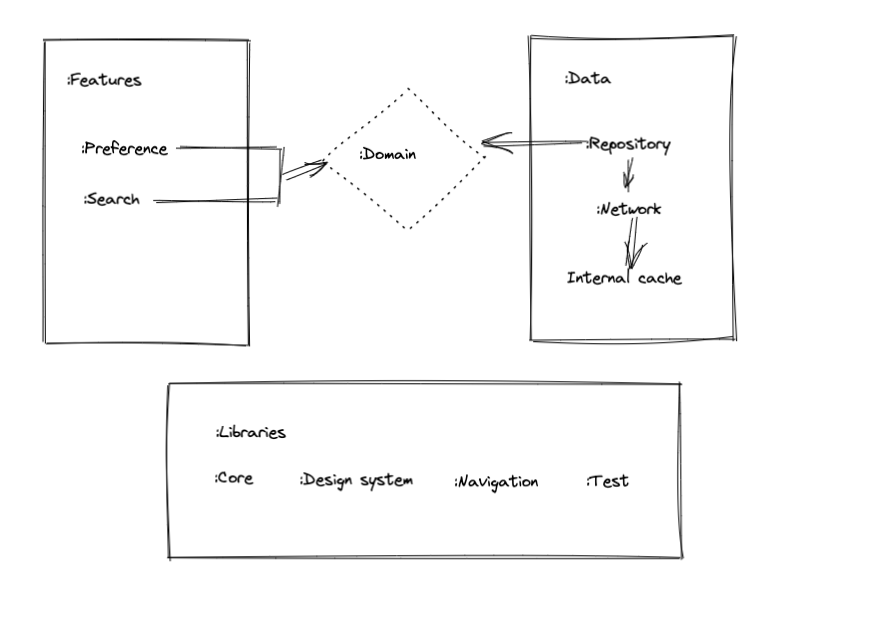

## Graph-ql  🤖
Build an Android application that allows a user to enter an organization name and then displays the top 3 most popular (by stars) repositories on GitHub for that organization.   
A user should be able to click on one of the Repos and navigate to it within a webview or chrome custom tabs.
You can find details on the API here: https://developer.github.com/v3/

This code is based on my compose-template available here: https://github.com/lupsyn/compose-template

Generally this is a playgroud for a graph-ql integration.

## Features 🎨

- **100% Kotlin-only**.
- Dependecy injection with Koin
- Data, domain, libraries and feature module
- Compose UI
- 100% Gradle Kotlin DSL setup.
- CI Setup with GitHub Actions
- Dependency versions managed via `TOML`.
- Issues Template (bug report + feature request).
- Pull Request Template.

## 🏛 Architecture

Let's take a look in each major module of the application:

* **app** - The Application module. It contains all the initialization logic for the Android
  environment and starts the _Jetpack Navigation Compose Graph_.
* **features** - The module/folder containing all the features (visual or not) from the application
* **domain** - The modules containing the most important part of the application: the business
  logic. This module depends only on itself and all interaction it does is via _dependency
  inversion_.
* **data** - The module containing the data (local, remote etc) from the app

To better represents the idea behind the modules, here is a architecture image representing the flow
of dependency:

